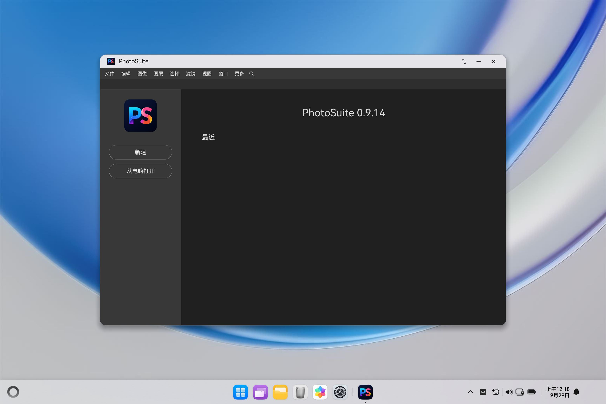

# PhotoSuite for HarmonyOS

A complete port of **[PhotoSuite](https://github.com/eolix/photosuite)** —
the desktop image editor faithfully replicating classic Adobe Photoshop with
1:1 native PSD/PSB compatibility — to **HarmonyOS 6.1.1 (API 24)** on tablet
and 2in1 devices.

The entire upstream application (`upstream@efc54dd`: editor, layers, filters,
WASM codecs, PSD/PSB engine) runs **unmodified** on HarmonyOS with the exact
same UI as the desktop original.



*PhotoSuite 0.9.14 start screen on the HarmonyOS 6.1.1 2in1 emulator
(3120×2080): native menu bar, PS branding, New / Open actions, Recents —
pixel-for-pixel the desktop experience.*

## How it works

Tauri officially targets desktop and mobile only — there is no HarmonyOS
target — so the desktop Rust host (`src-tauri/`) is replaced by a native
ArkTS host under `harmony/` that serves the untouched web UI in a `Web`
component and answers the exact same `window.__TAURI__` command set:

```
┌─────────────────────────────┐      ┌──────────────────────────────┐
│  upstream src/ (1-to-1)     │      │  harmony/ ArkTS host         │
│  index.html, UI, engine,    │◄────►│  LocalHttpServer (loopback)  │
│  WASM, PSD/PSB, filters     │ HTTP │  TauriShim (window.__TAURI__)│
│                             │      │  TauriBridge (native impl)   │
└─────────────────────────────┘      │  ResourceServer (fallback)   │
                                     └──────────────────────────────┘
```

Two platform problems had to be solved with zero changes to upstream files:

1. **Absolute asset paths** (`/core/i18n/…`, `/assets/…`) resolve against
   the rawfile root, so the web tree is synced to the rawfile root.
2. **ArkWeb blocks XHR/fetch and ES-module loads to `resource://`**
   (null origin, CORS), which stalls boot at the synchronous
   `languages.json` load and blocks `main.js` entirely. A minimal loopback
   HTTP server (`LocalHttpServer.ets`, 127.0.0.1, `INTERNET` permission for
   loopback only) serves the same rawfile bytes over
   `http://127.0.0.1:<port>/`, making every subresource same-origin — the
   app then boots exactly as on desktop.

## Bridge coverage

Every desktop `core.invoke` command is answered — file open/save through
`DocumentViewPicker`, whole-file reads/writes, JSON-file stores
(`settings.json` plus both thumbnail caches), text clipboard, confirm/info
dialogs, system-font listing, bundled notices, native-menu install
(accepted; the in-page HTML menu stays since the UA is not macOS),
app exit, printer query (empty + warning, as on printer-less desktops),
sidebar-plugin and user-resource directories, recent-thumbnail bookkeeping,
`plugin:shell|open` (openLink), `plugin:dialog|message` — plus OS
file-open via `want.uri` → pending queue → `take_pending_open_files`
(desktop "Open With" parity).

Known deltas vs desktop: image clipboard falls back to in-app buffers,
printing is unavailable, system fonts list without readable paths. The
editor, layers, filters, WASM codecs, stores and dialogs all run
unmodified — see [`docs/TEST-REPORT.md`](docs/TEST-REPORT.md).

## Layout

- `src/`, `src-tauri/`, `tests/`, `docs/`, … — upstream fork, 1-to-1
- `harmony/` — this platform shell:
  - `AppScope/` — bundle `app.photosuite.harmony`, v0.9.14 (versionCode 9014)
  - `entry/src/main/ets/pages/Index.ets` — full-screen `Web` + wiring
  - `entry/src/main/ets/bridge/` — `TauriShim` (JS bootstrap),
    `TauriBridge` (invoke router), `LocalHttpServer`, `ResourceServer`
  - `entry/src/main/ets/entryability/` + `ets/open/` — ability &
    want-URI queue
  - `entry/src/main/resources/rawfile/` — **generated** from `src/` by
    `scripts/sync-www.sh` (gitignored; 25,634 files)
  - `docs/` — screenshots + [`TEST-REPORT.md`](docs/TEST-REPORT.md)

## Prerequisites

- HarmonyOS Command Line Tools 6.1.1 (hvigor 6.24.2, ohpm 6.1.2, SDK API 24)
- JDK 17 (`brew install openjdk@17`), Node (upstream tooling wants v25+)
- `~/.npmrc` containing `@ohos:registry=https://repo.harmonyos.com/npm/`

## Build (unsigned debug HAP)

```bash
export PATH="$HOME/Developer/command-line-tools/bin:/opt/homebrew/opt/openjdk@17/bin:$HOME/Developer/command-line-tools/tool/node/bin:$PATH"
export DEVECO_SDK_HOME="$HOME/Developer/command-line-tools/sdk"
export JAVA_HOME="/opt/homebrew/opt/openjdk@17/libexec/openjdk.jdk/Contents/Home"
cd harmony
ohpm install
sh scripts/sync-www.sh
hvigorw assembleApp
# outputs: build/outputs/default/*.app + entry HAP (256 MB, full web tree)
```

Upstream suite from the repo root (proves the fork is intact):

```bash
npm install && npm run vendor:fixlinks && npm test   # 1715/1715 pass
```

## Emulator (2in1, HarmonyOS 6.1.1)

Image download is geo-gated to the Chinese mainland since DevEco 6.1.0
Beta1; the locale/timezone exports below are enough — no proxy needed:

```bash
export PATH="$HOME/Developer/command-line-tools/bin:$PATH"
export LANG=zh_CN.UTF-8
export LC_ALL=zh_CN.UTF-8
export TZ=Asia/Shanghai
Emulator -license accept
Emulator -imageList -deviceType 2in1
Emulator -install -deviceType 2in1 -osVersion "HarmonyOS 6.1.1(24)" -force
# ~2.5 GB ARM64 image
Emulator -create OpenPhotoSuite2in1 -deviceType 2in1 -osVersion "HarmonyOS 6.1.1(24)"
ln -sfn ~/Developer/command-line-tools/sdk ~/Developer/sdk
Emulator -start OpenPhotoSuite2in1
# once hdc lists 127.0.0.1:5555 (hdc is under
# command-line-tools/sdk/default/openharmony/toolchains/):
hdc -t 127.0.0.1:5555 install <entry-default-unsigned.hap>
hdc -t 127.0.0.1:5555 shell aa start -b app.photosuite.harmony -a EntryAbility
# open a file with the app (desktop Open-With parity):
hdc -t 127.0.0.1:5555 shell "aa start -b app.photosuite.harmony \
  -a EntryAbility -U file:///path/to/image.png"
```

## Test report

[`docs/TEST-REPORT.md`](docs/TEST-REPORT.md) records the full results:
upstream suite 1715/1715, clean `hvigorw assembleApp`, emulator install +
launch with the complete boot-invoke trace, the OS file-open pipeline
result, and the input limits of the emulator session used here.

## License

GPL-3.0-only, same as upstream (`LICENSE` at repo root).
